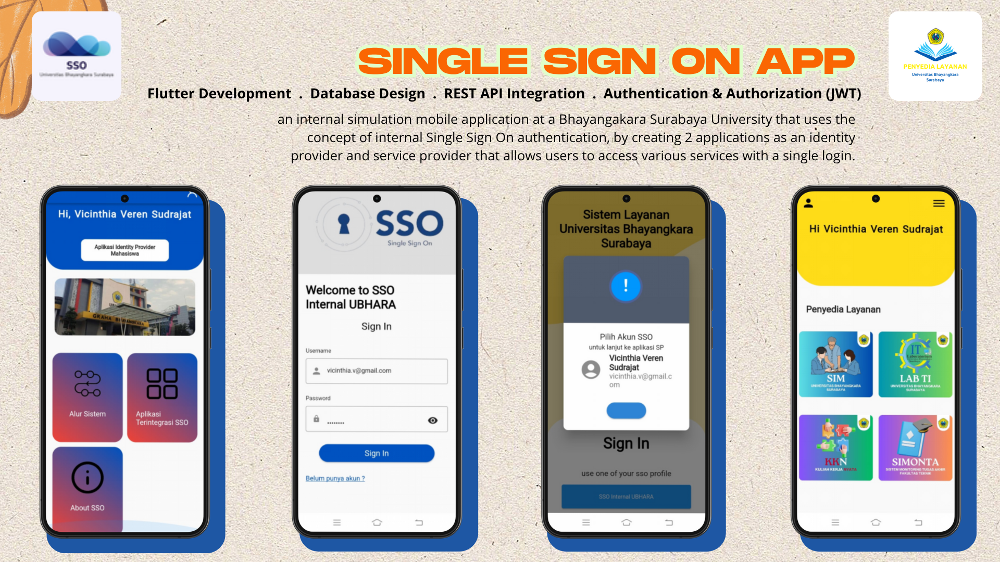
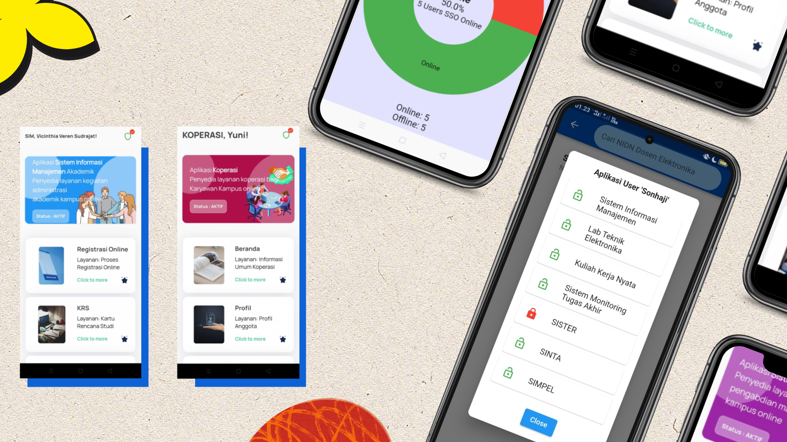

# Identity Provider & Service Provider
# Single Sign-On (SSO) - Mobile System

an internal simulation mobile application at a Bhayangakara Surabaya University that uses the concept of internal Single Sign On authentication, by creating 2 applications as an identity provider and service provider that allows users to access various services with a single login.

## 🛠 Tech Stack
- Flutter
- PHP REST API
- MySQL
- Authentication & Authorization (JWT) 

## 📌 Main Features
- 🔑 **Single Sign-On (SSO)**-based login simulation
- 🔐 **JWT (JSON Web Token)** for secure, token-based authentication
- 👥 **Role-Based Access Control (RBAC):**
  - **Admin**: Full access to manage users, view logs, and configure settings
  - **Student**: Access to student dashboard and resources
  - **Employee**: Access to internal services for staff
- 🔒 Protected routes and APIs based on user roles
- 📄 Token validation and session management
- 🎯 Simulated login flows and role-based redirects

## 📄 Documentation Product
[📘 Lihat Doc PDF](https://drive.google.com/file/d/10BypbXi_PhEctjF5QH1rDNKrbnHad8-C/view?usp=sharing)

## 📱 UI Preview

## 🚀 Video Demo APP
[⬇️ Video APK](https://drive.google.com/file/d/19hk9Umtb1Sjqc30Oc9av9Kxj1iMx1sIn/view?usp=sharing)

## 👤 My Contribution
I worked on all parts of this application myself, including :
- UI design and creation using Flutter.
- Backend implementation using PHP Rest API and MySQL.
- Create a standard Json Web Token authentication system with Internal SSO method (without involving third parties such as Google, Facebook, etc.)
- Application testing and debugging.